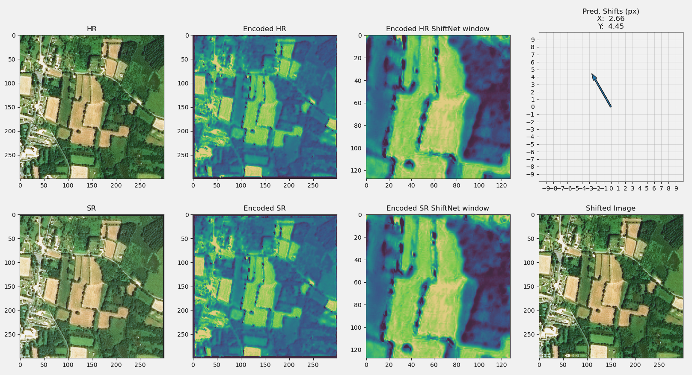

# SiameseShiftNet  
NN predicting spatial coregistration shift of remote sensing imagery.  
Predicts and applies X and Y affine transforms based on a 128x128 center crop of the input images, which have been encoded separately. Encodings are calculated based on all bands and represented as a single channel encoding.  
Adapted from [HighResNet - ShiftNet](https://github.com/ServiceNow/HighRes-net/blob/master/src/DeepNetworks/ShiftNet.py "ShiftNet")  

## Data. 
10k 300x300px SPOT6 images. Download [here](https://drive.google.com "redacted"), unpack in "data" folder in repo root. Contaings 'train' and 'val' data, out of which only train is used for now.

